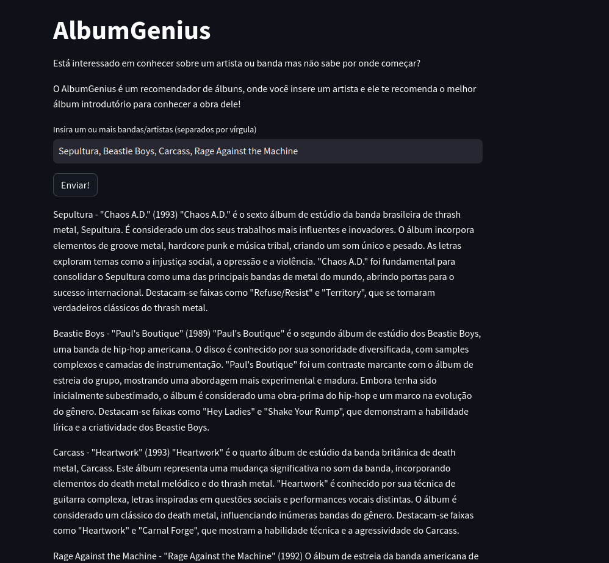
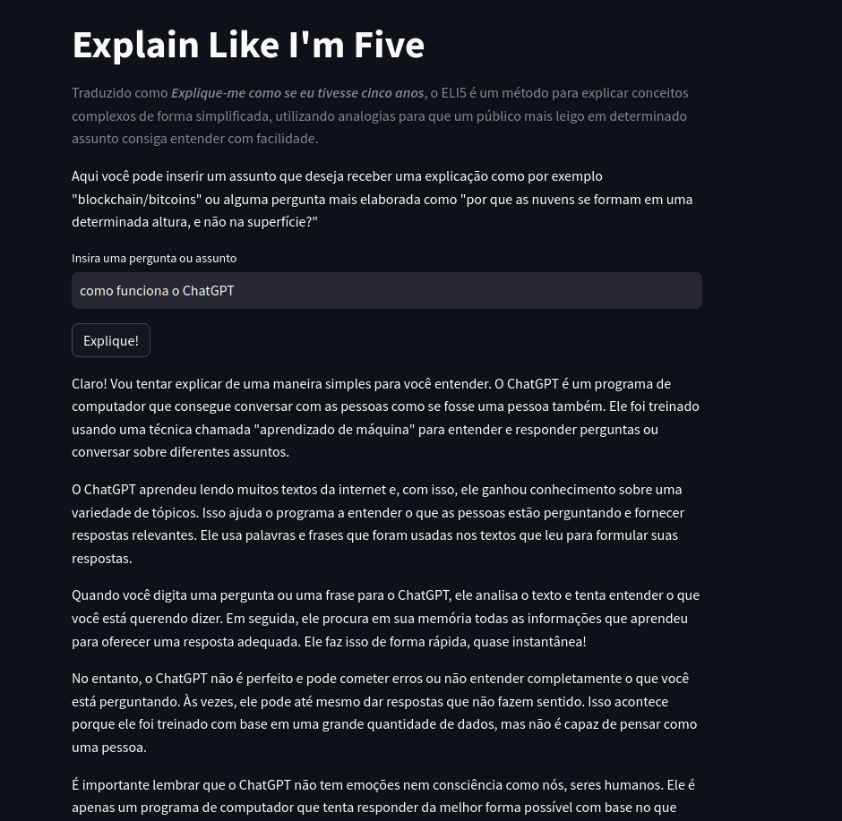

# Desafio XP

O seguinte projeto foi desenvolvido para um desafio técnico da XP que interage com o LLM da OpenAI, recebendo input do
usuário, retornando a resposta do LLM, a partir dos frameworks **streamlit** e **langchain**.

O projeto possui duas funcionalidades.

Uma delas, chamada de **AlbumGenius** é um recomendador de álbuns que recebe do usuário um ou mais artistas e recomenda
o melhor álbum introdutório para conhecer o artista.



A segunda funcionalidade é a **ELI5**, inspirado pelo sub do reddit Explain Like I'm 5, onde o usuário insere uma pergunta
ou assunto, e o programa retorna uma explicação simplificada e com analogias para mais facil entendimento para leigos no assunto.



## Pré-requisitos

Antes de começar, certifique-se de que você tenha o Python 3 instalado em seu sistema. Se você não tiver o Python instalado, você pode baixá-lo em [python.org](https://www.python.org/downloads/) ou através do gerenciador de pacotes do seu sistema operacional.

## Configurando a API Key da OpenAI

Acesse https://platform.openai.com/signup para criar uma conta na OpenAI, caso ainda não tenha uma.

Após criar sua conta e fazer login, vá para a seção de configurações da API.

Crie um novo projeto ou selecione um projeto existente para gerar uma API key. Siga as instruções na plataforma para criar seu projeto e obter a API key correspondente.

Depois de obter sua API key, crie um arquivo `.env` na raiz do projeto e insira a API key substituindo YOUR_API_KEY pela sua chave.

```OPENAI_API_KEY=YOUR_API_KEY```
## Instalação

Siga estas instruções para configurar e instalar as dependências do projeto.

1. Clone o repositório do GitHub:

   ```shell
   git clone https://github.com/r1ckhdk/desafio-xp.git
   cd desafio-xp
   ```
2. Inicie um ambiente virtual (opcional, mas recomendado):

   ```shell
   python3 -m venv venv
   source venv/bin/activate
   ```
3. Instale as dependências:
    
    ```shell
   pip install -r requirements.txt
   ```
## Executando a aplicação

   ```shell
   streamlit desafio_xp.py
   ```

## Executando a aplicação como container Docker

1. Na raiz do projeto `desafio-xp` que você clonou, execute o comando para buildar a imagem docker:

   ```shell
   docker build -t desafio_xp .
   ```

2. Execute o docker container:

   ```shell
   docker run -p 8501:8501 desafio_xp
   ```
   
3. Acesse o projeto em `localhost:8501`
